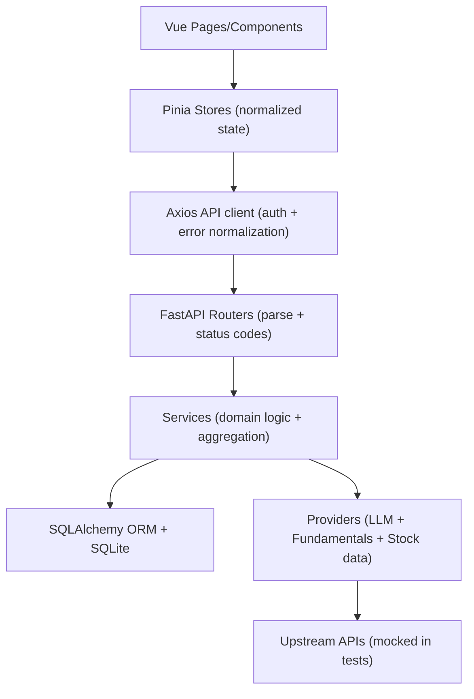

# Personal Finance Dashboard v1.0.0

Full-stack personal finance dashboard built as a job-ready portfolio project.

- Backend: FastAPI + SQLAlchemy + Alembic migrations (SQLite by default)
- Frontend: Vue 3 + Pinia + Vue Router + Vite
- Focus: clear data contracts, provider abstractions, deterministic fallbacks, and CI-reproducible workflows

## Project Positioning (Portfolio)

This project is intentionally designed to demonstrate production-minded engineering in a compact codebase:

- **Provider abstractions** (LLM + fundamentals) with **stable, deterministic fallbacks**
- **Normalized data contracts** (typed response models, consistent status semantics, explicit metadata)
- **Schema evolution** via **Alembic migrations** (no “reset-only” schema management)
- **Testability**: mock providers in tests; CI does not call real external APIs
- **Reproducible CI**: backend tests + frontend lint/test/build on clean environments

## Core Features

- Auth (register/login/me) with JWT bearer token
- Expense tracking + budget tracking + dashboard aggregates
- Watchlist with persisted price sync status (`pending`/`success`/`failed`)
- **AI insights endpoints** with provider switching and deterministic fallback
- **Fundamentals screening** backed by DB cache (explicit sync, stale detection, source/as-of metadata)

## System Architecture

Backend layers (high-level):

- `routers/`: HTTP endpoints + response models
- `services/`: domain logic (budget aggregation, AI request shaping, screening rules)
- `providers/`: external integration abstractions (LLM + fundamentals) with timeouts and predictable errors
- `models/`: SQLAlchemy ORM + Pydantic response contracts
- `db/`: engine/session + Alembic migration runner
- `alembic/`: migration scripts

Frontend layers (high-level):

- `api/`: typed HTTP calls
- `stores/`: state management + normalization
- `pages/`: UI rendering + error states

### Architecture Diagram



## AI Provider Design

Environment-controlled provider switching (no router-to-SDK coupling):

- `LLM_PROVIDER=openai`: calls OpenAI Responses API via `requests` (requires `OPENAI_API_KEY`)
- `LLM_PROVIDER=fallback`: deterministic local output (no external calls)
- `LLM_PROVIDER=mock`: test-only provider (returns `LLM_MOCK_TEXT`)

Runtime guarantees:

- Missing key or upstream failure **never crashes endpoints**; the API responds with a deterministic fallback and exposes provider metadata in `meta`.

## Fundamentals Provider + DB Cache Design

### Why cache?

Stock screening reads from normalized DB rows so that:

- the UI can show **exact data source + as-of date**
- screening is repeatable and debuggable
- external fetch failures do not break the screen endpoint

### Providers

- Current default provider: `yfinance` (wrapped with a timeout guard)
- Future providers can be added behind the same `BaseFundamentalsProvider` interface

### Data freshness

- `FUNDAMENTALS_TTL_HOURS` controls staleness detection (default 24h)
- `/api/stocks/filter` **does not fetch live**. Use `/api/stocks/fundamentals/sync` explicitly.

## Data Model Contracts

- Money-like fields use `Numeric/Decimal` in DB (API serializes to JSON numbers)
- `stock_prices.trade_date` is a real date type (`Date`), serialized as ISO (YYYY-MM-DD)
- Response models are defined for dashboard/AI/stocks metadata/fundamentals

### Watchlist Price Sync Contract

Watchlist items expose two compatible shapes:

- Legacy fields (kept for backward compatibility):
  - `price_sync_status`, `last_sync_error`, `last_sync_attempt_at`
- Stable nested contract (preferred):
  - `price_sync: { status, provider, as_of_date, last_attempt_at, error_message }`

### Watchlist Add vs Sync (Decoupled Semantics)

To keep creation deterministic and fast, watchlist creation does **not** depend on upstream availability:

- `POST /api/stocks/watchlist`:
  - Always creates the row with `status=pending`
  - Enqueues a best-effort background sync (price + display name)
- Explicit sync endpoints:
  - `POST /api/stocks/{code}/sync`
  - `POST /api/stocks/sync`

This keeps `201 Created` semantics clean while still persisting `success/failed` results on later sync attempts.

## Local Setup

### 1) Environment

```bash
cp .env.example .env
```

Windows PowerShell:

```powershell
Copy-Item .env.example .env
```

### 2) Backend

```bash
cd backend
python -m pip install -r requirements.txt
alembic upgrade head
python seed_data.py --reset
uvicorn main:app --reload
```

Backend URLs:

- API: http://localhost:8000
- Swagger: http://localhost:8000/docs

### 3) Frontend

```bash
cd frontend
npm ci
npm run dev
```

Frontend URL: http://localhost:5173

## Demo Account

- Email: `demo@example.com`
- Password: `demo1234`

## Testing

Backend (all provider integrations are mocked in tests):

```bash
cd backend
python -m pytest
```

Frontend:

```bash
cd frontend
npm test
```

## CI

GitHub Actions workflow runs on clean machines:

- backend: import smoke + `alembic upgrade head` smoke + `compileall` + `pytest`
- frontend: `lint` + `test` + `build`

See `.github/workflows/ci.yml`.

## Known Limits (Honest)

- `yfinance` is **not an official market data API** and may rate-limit or change behavior; the project exposes source/status and caches results to reduce impact.
- Fundamentals screen rules are intentionally simple baseline rules (documented in `services/fundamentals_screening.py`), and should be adjusted per strategy.

## Roadmap

- Add more fundamentals providers (official/commercial APIs) behind the same interface
- Add background scheduling for fundamentals refresh (optional)
- Add richer UI explanations for screening failures and provider errors

## Packaging and Cleanup

```powershell
powershell -ExecutionPolicy Bypass -File scripts/clean-delivery.ps1
```

## Screenshots (Placeholder)

Add screenshots under a future `docs/screenshots/` folder and embed them here:

- Dashboard overview
- Expenses form + list
- Budgets status
- Stocks watchlist + screening
