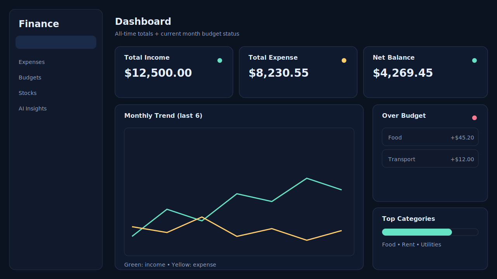
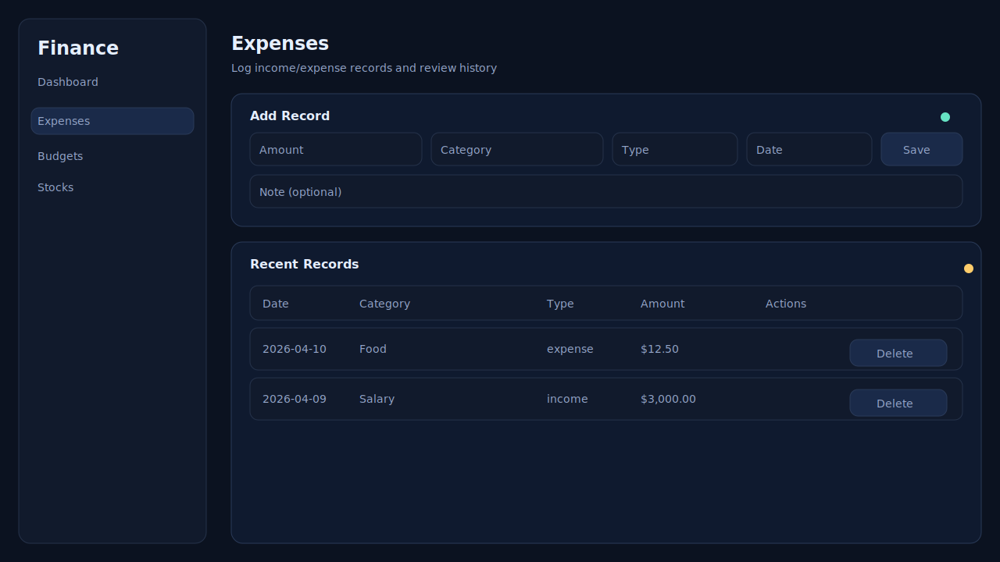
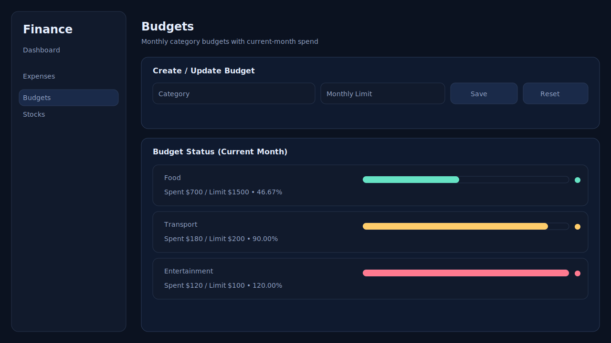
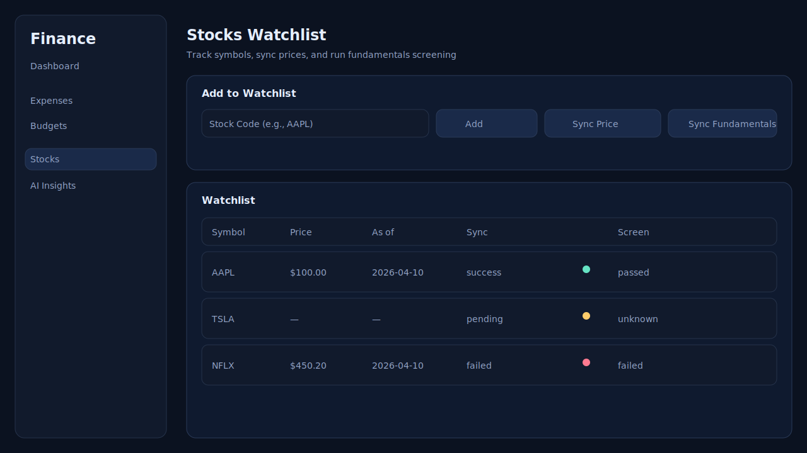

# Personal Finance Dashboard

> Full-stack personal finance dashboard with budgeting, expense tracking, stock watchlist, and AI insights — built with FastAPI + Vue 3.

## Feature Table

| Feature | Description |
|--------|-------------|
| Budget Tracking | Create monthly category budgets with current-month spend status |
| Expense Logging | Track income/expense records with categories, dates, and optional notes |
| Dashboard | Aggregated insights (totals, trends, category breakdown, over-budget list) |
| Stocks Watchlist | Track selected symbols and sync cached prices/fundamentals |
| AI Insights | Generate deterministic summaries/advice with provider metadata |

## Screenshots






## Architecture Overview

- Backend: FastAPI routers + Pydantic response contracts + SQLAlchemy ORM + Alembic migrations
- Frontend: Vue 3 pages + Pinia stores + Axios API client + contract normalizers
- Database: SQLite by default (via `DATABASE_URL`)
- External Providers: LLM provider (OpenAI/fallback/mock), fundamentals provider (`yfinance`) with DB cache

High-level flow:

```text
Frontend (Vue)
       ↓
API (FastAPI Routers)
       ↓
Services
       ↓
Database + Providers
```

## Data Flow

```text
User → Router → Service → DB → Response → Frontend Store → UI
```

## Quick Start

### 1) Environment

```bash
cp .env.example .env
```

Windows PowerShell:

```powershell
Copy-Item .env.example .env
```

### 2) Backend (FastAPI)

```bash
cd backend
python -m pip install -r requirements.txt
alembic upgrade head
uvicorn main:app --reload
```

Optional (SQLite demo data/reset):

```bash
cd backend
python seed_data.py --reset
```

Backend URLs:

- API: http://localhost:8000
- Swagger: http://localhost:8000/docs

### 3) Frontend (Vue 3)

```bash
cd frontend
npm install
npm run dev
```

Frontend URL: http://localhost:5173

## API Design Principles

- RESTful routes with clear resource boundaries (`/api/expenses`, `/api/budgets`, `/api/stocks/*`, `/api/ai/*`)
- `204 No Content` for successful DELETE (empty body)
- Normalized responses (typed response models; consistent serialization for money/date fields)
- User-scoped resources (JWT bearer auth; CRUD is scoped to the current user)

## Testing Strategy

- Backend: `pytest` (SQLite in-memory), provider calls mocked in tests
- Frontend: `vitest` + `@vue/test-utils` + `jsdom`
- Contract tests: validate serialization + response shape (no user-scoped leakage)
- Smoke tests: end-to-end API flows (auth → CRUD → dashboard aggregates)

## Why This Project Stands Out

- Provider abstraction design
- Shared cache architecture
- API contract normalization
- Full CI pipeline
- Production-style layering

## CI

GitHub Actions workflow runs on clean machines:

- backend: import smoke + `alembic upgrade head` smoke + `compileall` + `pytest`
- frontend: `lint` + `test` + `build`

See `.github/workflows/ci.yml`.

## Future Improvements

- Recurring transactions
- Budget alerts
- Export reports

